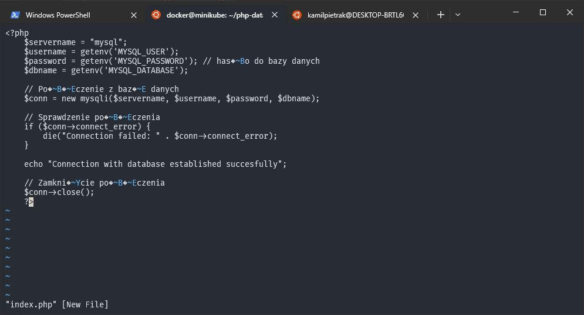
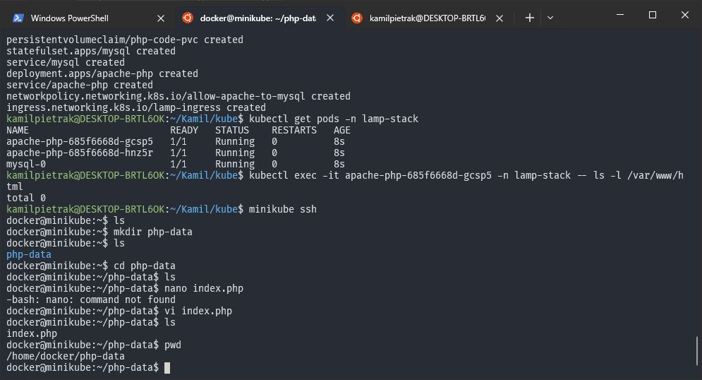
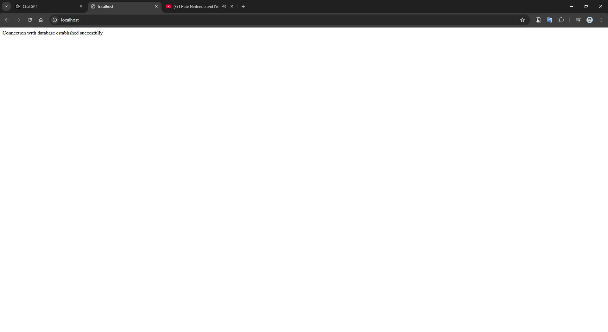

Kamil Pietrak, 095523, GL 2.3 

# Zadanie 2 - Sprawozdanie 

Zdecydowałem się na implementacje stacka LAMP (Linux, Apache, Mysql, PHP). 
Głównym założeniem było aby stack mógł operawać na stronach które znajdują się na maszynie użytkownika i w łatwy sposób moc je updatować.

Zasoby użyte do wdrożenia stacka to : 
 - Namespave
 - Secret
 - ConfigMap
 - PersistanceVolume (PV)
 - PersistanceVolumeClaim (PVC)
 - StatefulSet (z Servisem Headless)
 - Deployment (z Servisem typu NodePort)
 - NetworkPolicy
 - Ingress

## Omówienie zasobów
Cała konfiguracja wszystkich obiektów znajduje się w jednym manifeście `zaliczenie.yaml`.

### Namespace
Utworzono namespace o nazwie **lamp-stack**, resztę obiektów utworzono właśnie w tym manifescie.

```yaml 
apiVersion: v1
kind: Namespace
metadata:
  name: lamp-stack
```

### Secret
Hasła użytkowników baz danych, zarówno root jak i użytkownika dostepnego z poziomu aplikacji przechowywane są w obiekcie typu Secret. Dane podawane do Secret musza być enkodowane do formatu Base64.

```yaml
apiVersion: v1
kind: Secret
metadata:
  name: mysql-secrets
  namespace: lamp-stack
type: Opaque
data:
  MYSQL_ROOT_PASSWORD: cm9vdHBhc3N3b3Jk    # Base64-encoded 'rootpassword'
  MYSQL_PASSWORD: bXlzcWxwYXNzd29yZA==     # Base64-encoded 'mysqlpassword'
```

### ConfigMap

Zmienne środowiskowe przechowywane są w obiekcie typu **ConfigMap**. Informacjami przechowywanymi w tym obiekcie są:
 - Nazwa basy danych `MYSQL_DATABASE`
 - Nazwa urzytkownika dostępnego z poziomu aplikacji `MYSQL_USER`

```yaml
apiVersion: v1
kind: ConfigMap
metadata:
  name: apache-php-config
  namespace: lamp-stack
data:
  MYSQL_DATABASE: exampledb
  MYSQL_USER: mysqluser
```

### PersistentVolume

Pliki hostowane przez stos (html, php i inne) dostepne są w aplicaji poprzez PersistanceVolume który odwołuje sie do danych na lokalnej maszynie, zawartych w folderze `/home/docker/php-data`.
Na potrzeby tego wdrożenia maksymalny rozmiar plików przechowywanych w tym folderze nie może łącznie przekroczyć 1Gi co na potrzeby działańdeveloperskich jest wartościa wystarczającą.

```yaml
apiVersion: v1
kind: PersistentVolume
metadata:
  name: php-code-pv
  namespace: lamp-stack
spec:
  storageClassName: default
  capacity:
    storage: 1Gi
  accessModes:
    - ReadWriteMany
  hostPath:
    path: /home/docker/php-data
```

### PersistanceVolumeClaim

To obiekt pozwalający na przypisanie pamieci do Poda. Wymaga on podania nazwy StorageClass (w tym przypdaku jest to klasa zdefiniowana defaultowo). 

```yaml
apiVersion: v1
kind: PersistentVolumeClaim
metadata:
  name: php-code-pvc
  namespace: lamp-stack
spec:
  storageClassName: default
  accessModes:
    - ReadWriteMany
  resources:
    requests:
      storage: 1Gi
```

### StatefulSet

Obiekt ten posłużył do wdrożenia bazy danych MySQL. Wybrałem ten obiekt ponieważ dane które są przechowywane w ramach jego działania nie są tracone podczas restart, pozwala to na trwałe przechowywanie danych testowych (devaloperskich) w bazie danych. Zdecydowałem się ustawić ilość replik na 1 poniważ w celach developerskich nie potrzeba zalet jakie dają replikaset bazodanowe. Rozwiązanie to ogranicz również ilość konfigóracji bazy danych aby taki replica set stworzyć. Obiekt korzysta ze zmiennych środowisklowych udostępnianych przez obiekt **ConfigMap** oraz obiekt **Secret**.

```yaml
apiVersion: apps/v1
kind: StatefulSet
metadata:
  name: mysql
  namespace: lamp-stack
spec:
  serviceName: "mysql"
  replicas: 1
  selector:
    matchLabels:
      app: mysql
  template:
    metadata:
      labels:
        app: mysql
    spec:
      containers:
      - name: mysql
        image: mysql
        env:
        - name: MYSQL_ROOT_PASSWORD
          valueFrom:
            secretKeyRef:
              name: mysql-secrets
              key: MYSQL_ROOT_PASSWORD
        - name: MYSQL_DATABASE
          valueFrom:
            configMapKeyRef:
              name: apache-php-config
              key: MYSQL_DATABASE
        - name: MYSQL_USER
          valueFrom:
            configMapKeyRef:
              name: apache-php-config
              key: MYSQL_USER
        - name: MYSQL_PASSWORD
          valueFrom:
            secretKeyRef:
              name: mysql-secrets
              key: MYSQL_PASSWORD
        ports:
        - containerPort: 3306
          name: mysql
        volumeMounts:
        - name: mysql-data
          mountPath: /var/lib/mysql
  volumeClaimTemplates:
  - metadata:
      name: mysql-data
    spec:
      accessModes: ["ReadWriteOnce"]
      resources:
        requests:
          storage: 1Gi
```

Dla obiektu StatefulSet zdefiniowano obiekt Service typu Headless który odpowiedzialny jest za udostępnianie połaczenia do bazy danych wewnatrz klastra. Service typu Headless to specjalny servis dla którego parametr **clusterIP** przyjmuje wartość **None**.

```yaml
apiVersion: v1
kind: Service
metadata:
  name: mysql
  namespace: lamp-stack
spec:
  ports:
  - port: 3306
  selector:
    app: mysql
  clusterIP: None
```

### Deployment

Plikacja appache obsługująca interpreter PHP uruchomiona jest za pomocą obiektu **Deployment**. Ilość replik ustawiona jest 2 aby mozliwe było przetestiowanie jak aplikacja zachowa się gdy będzie działała w klastrze. Do obiektu podpięte są obiekty **Secret** oraz **ConfigMap** aby dostępne były hasło i nazwa urzytkownika bazy danych. Dodatkowo do obiektu podpiołem wcześniej utworzony **PersistanceVolumeClaim** w którym dostępne są pliki  aplikacji (html, php i inne).

```yaml
apiVersion: apps/v1
kind: Deployment
metadata:
  name: apache-php
  namespace: lamp-stack
spec:
  replicas: 2
  selector:
    matchLabels:
      app: apache-php
  template:
    metadata:
      labels:
        app: apache-php
    spec:
      containers:
      - name: apache-php
        image: php:7.4-apache
        command: ["/bin/sh"]
        args: ["-c", "docker-php-ext-install mysqli && docker-php-ext-enable mysqli && apache2-foreground"]
        env:
        - name: MYSQL_DATABASE
          valueFrom:
            configMapKeyRef:
              name: apache-php-config
              key: MYSQL_DATABASE
        - name: MYSQL_USER
          valueFrom:
            configMapKeyRef:
              name: apache-php-config
              key: MYSQL_USER
        - name: MYSQL_PASSWORD
          valueFrom:
            secretKeyRef:
              name: mysql-secrets
              key: MYSQL_PASSWORD
        ports:
        - containerPort: 80
        volumeMounts:
        - name: app-code
          mountPath: /var/www/html
      volumes:
      - name: app-code
        persistentVolumeClaim:
          claimName: php-code-pvc
```
Do tego obiektu utworzono obiekt **Service** typu **NodePort** za pomoca którego mamy dostęp do hostowanej tam zawartości.
 
```yaml
 apiVersion: v1
kind: Service
metadata:
  name: apache-php
  namespace: lamp-stack
spec:
  ports:
  - port: 80
  selector:
    app: apache-php
  type: NodePort
```

### Network Policy

Obiekt ten pozwala kontrolować dostęp do poszczególnych zasobów dostępnych na poziomie klastra, komunikacja po między podami. W tym przypdaku pozwolo na komunikacje pomiędzy podami z MySQL a podami z Apache/PHP na porcie 3306 (defaultowy port servera MySQL).

```yaml
apiVersion: networking.k8s.io/v1
kind: NetworkPolicy
metadata:
  name: allow-apache-to-mysql
  namespace: lamp-stack
spec:
  podSelector:
    matchLabels:
      app: mysql
  ingress:
  - from:
    - podSelector:
        matchLabels:
          app: apache-php
    ports:
    - protocol: TCP
      port: 3306
  policyTypes:
  - Ingress
```

### Ingress

Ostatnim obiektem stworzonym w tym deploymencie jest Ingress. Pozwala on na dostęp do serwisów z zewnątrz, np.: przez przeglądarkę.

```yaml
apiVersion: networking.k8s.io/v1
kind: Ingress
metadata:
  name: lamp-ingress
  namespace: lamp-stack
  annotations:
    nginx.ingress.kubernetes.io/rewrite-target: /
spec:
  rules:
  - http:
      paths:
      - path: /
        pathType: Prefix
        backend:
          service:
            name: apache-php
            port:
              number: 80
```
## Wynik działania

Aby stack działał prawidłowo, host Windows 10 i minikube działający W Docker za pomocą WSL, najpierw przygowowane plik nalerzy zgrać do odpowiedniego folderu w konteneże minikube. Można to zrobić za pomocą SSH (minikube ssh) lub używając SSH File Transfer lub wielu innych jak edytowanie za pomocą VS Code bezpośrenio w kontenerze za pomocą tunelu ssh. W przypdaku maszyn z linuxem ten krok 
prawdopodobnie nie będzie potrzebny.



 

Aby Ingress działał poprawnie w minikube nalerzało włączyć plugin `ingress` addon using comman `minikube addons enable ingress`.


Wyniki działania stacku przeddstawia przeglądarka



Dane z PersistanceVolume są dostępne w appache ponieważ widzimy stronę której kod to

```php
<?php
    $servername = "mysql";
    $username = getenv('MYSQL_USER');
    $password = getenv('MYSQL_PASSWORD'); // hasło do bazy danych
    $dbname = getenv('MYSQL_DATABASE');

    // Połączenie z bazą danych
    $conn = new mysqli($servername, $username, $password, $dbname);

    // Sprawdzenie połączenia
    if ($conn->connect_error) {
        die("Connection failed: " . $conn->connect_error);
    }

    echo "Connection with database established succesfully";

    // Zamknięcie połączenia
    $conn->close();
?>
```

Analizując powyższy kod, zauważyć możemy że komunikacja pomiedzy bazą danych a PHP/Apache równiez dziła prawidłowo ponieważ widzimy napis **Connection with database established succesfully** zamiast **Connection failed: ...** który wystąpił by w przypdaku gdyby wystąpił jaki kolwiek błąd.